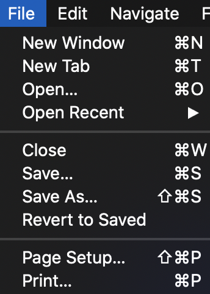
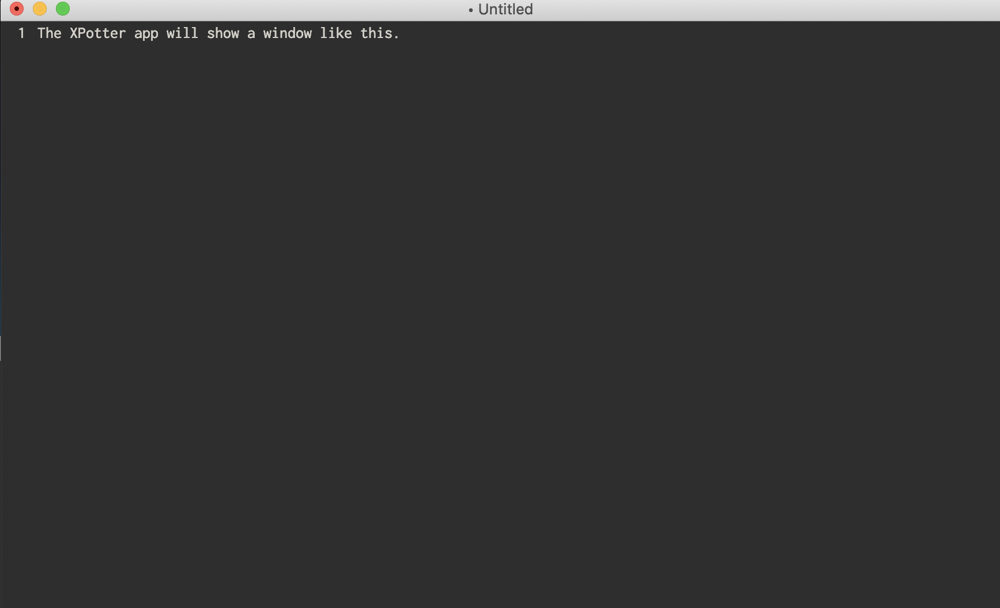
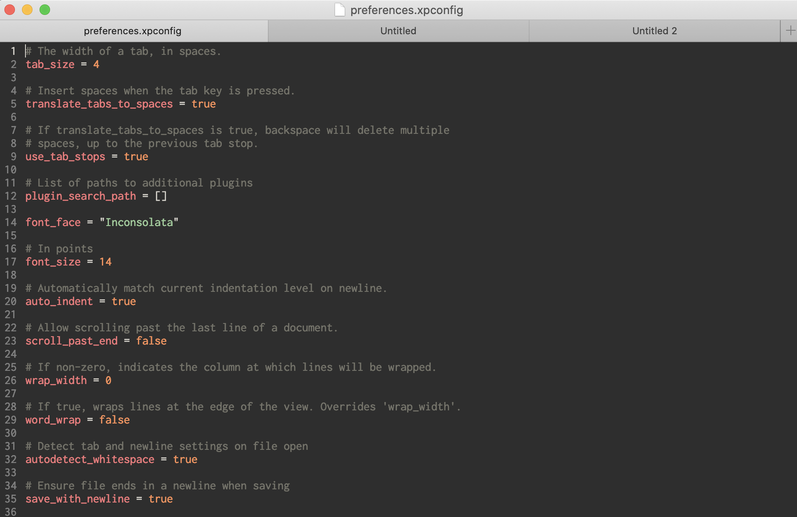
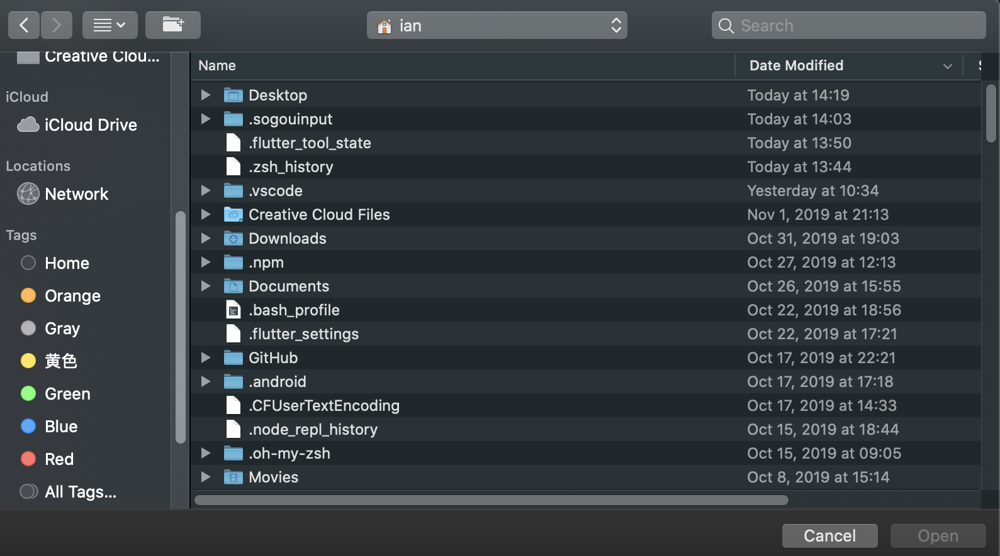
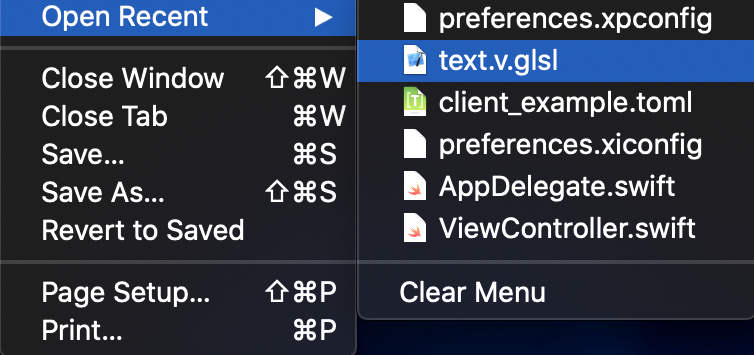
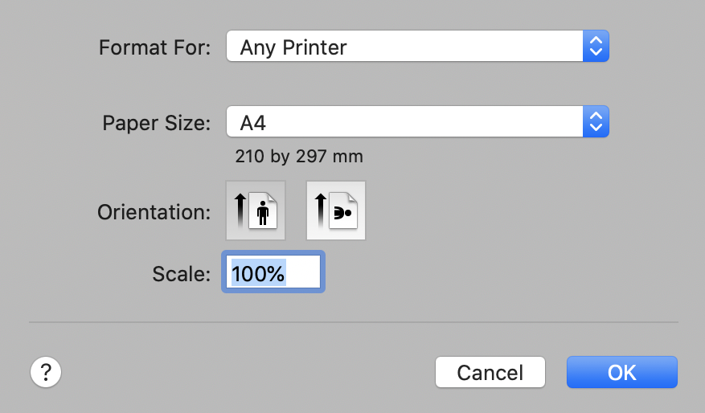

# Introducation

This document will tell you some usefull contents.

When you click the `XPotter` App's window `Menu -> File`, you will get some sub menu items.

 File image" style="width:160px;">

## 1. Contents

### 1.1. New Window

You click the sub menu item, `XPotter` will open a new empty content window for edit.

 File -> New Window image" style="width:600px;">

### 1.2. New Tab

You click the sub menu item, `XPotter` will open a new tab view as a tab in current window

 File -> New Tab image" style="width:600px;">

### 1.3. Open...

You click the sub menu item, `XPotter` will show a open file dialog that you can choose a file to edit.

 File -> Open a file image" style="width:600px;">

### 1.4. Open Recent

The recent files which you open them before. You can choose one file to reopen it again.

 File -> Open Recent image" style="width:320px;">

### 1.5. Close

It contains two items:

* Close Window: close the editing and activing window.
* Close Tab: Only close the editing and activing tab window.

### 1.6. Save

You click the sub menu item, `XPotter` will save the current file that it editing and activing.

### 1.7. Save As...

You click the sub menu item, `XPotter` will show a save as file dialog to save the current file content that it editing and activing.

### 1.8. Revert to Saved

You click the sub menu item, `XPotter` will help you revert the current editing and activing file content to latest save state.

### 1.9. Page Setup...

You click the sub menu item, `XPotter` will show a `Page Setup` dialog. You can print the current file content use this page setup settings.

 File -> Page Setup image" style="width:320px;">

### 1.10. Print...

You click the sub menu item, `XPotter` will print the current file content.
