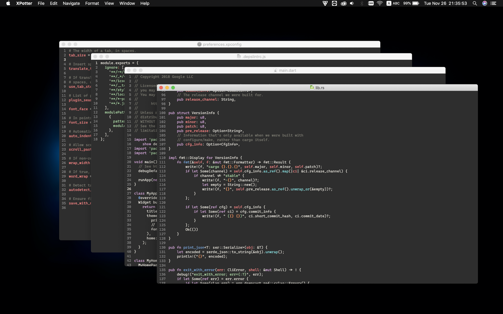

# XPotter

The XPotter project is an attempt to build a high quality tool platform, using modern software engineering techniques. It is initially built for macOS, using Cocoa for the user interface.

**Welcome to the XPotter User Guide! Choose a topic from the left to find answers, get step-by-step instructions, and develop your skills.**

 

## Goals include:

- **Incredibly high performance.** All operations should commit and paint in under 16ms. The editor should never make you wait for anything.

- **Reliability.** Crashing, hanging, or losing work should never happen.

- **Normal user and developer friendliness.**

- **More tools**
